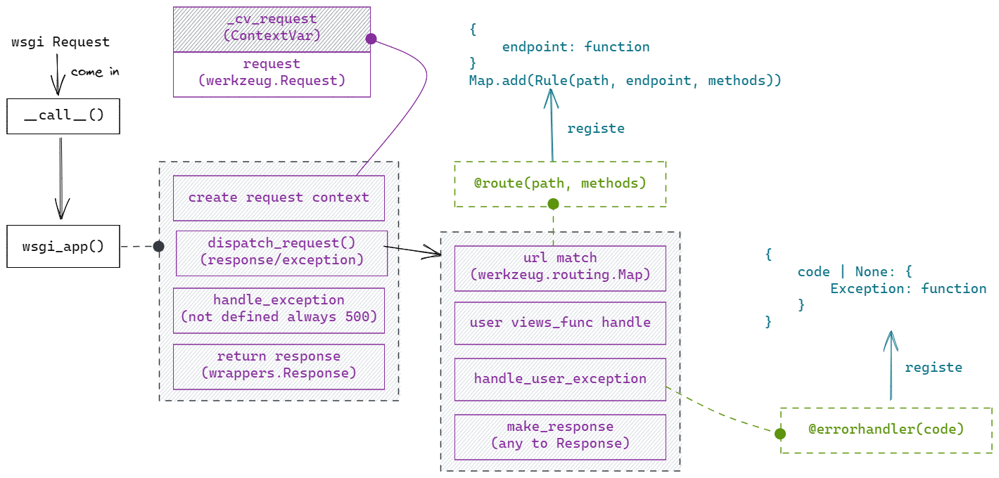
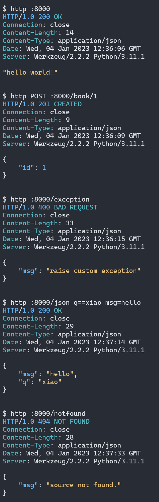

# durian

WSGI API application framework base on werkzeug (similar to Flask).

> This is a note-taking project for learning the Flask source code, aimed at gaining a deeper understanding of the inner workings of Flask and implementing a minimal web framework. Flask is an excellent web framework, so remember to avoid reinventing the wheel. And this project is not guaranteed to be maintained.

**Include**

- url router (Werkzeug) and router decorator
- Global request (base on ContextVar)
- APIException and Exception decorator
- only JSONResponse
- Type hint

**Exclude**

- custom header
- session
- app config
- Blueprint
- ClassView
- template (jinja2)
- file
- signal
- before/after decorator
- cli
- log



## Requirements

- Python 3.10+
- Werkzeug 2.2.2+

## Example

`example/app.py`

```python
from durian import API, APIException, request

app = API()


@app.route("/")
def index():
    """simple JSON response"""
    return "hello world!"


@app.route("/book/<int:id>", methods=["POST"])
def book(id):
    """url_parser method status_code response_type"""
    return {"id": id}, 201


@app.route("/exception")
def raise_exception():
    raise APIException({"msg": "raise custom exception"}, 400)


@app.route("/json", methods=["POST"])
def handle_json():
    """handle request body and query param"""
    data = request.json or {}
    q = request.args.get("q", "")
    return {**data, "q": q}


@app.errorhandler(404)
def not_found(exception):
    """define custom error handler"""
    return APIException({"msg": "source not found."}, 404)


app.run("127.0.0.1", 8000)

```

run `python example/app.py` result


